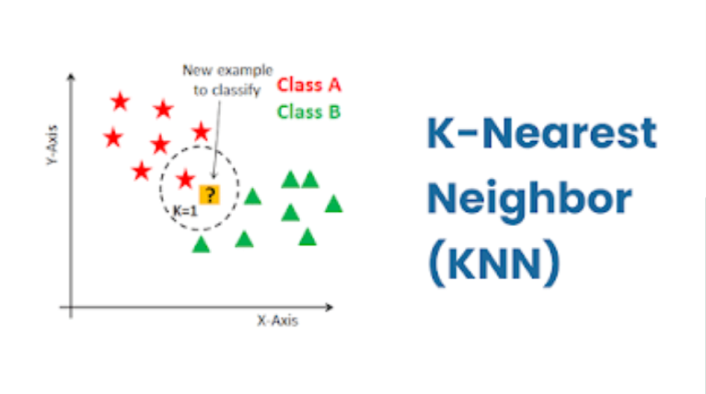
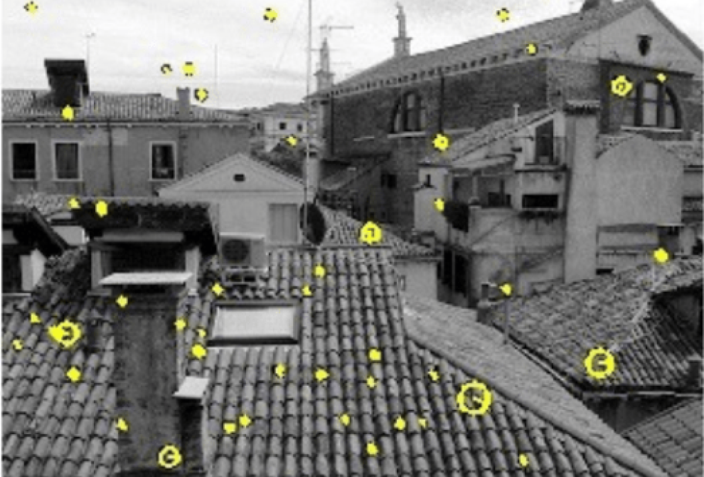

# MonEye

## Description

MonEye is a web-based application (powered by Flask) that can detect and count Indonesian banknotes (Rupiah). By utilizing numerical parameters (denomination) and images of banknotes, MonEye can detect and count vertically or horizontally oriented banknotes captured by a camera. Additionally, it provides the nominal value of the banknotes through text and audio, aiming to assist users with visual impairments.

## Methodology
**Modified K-Nearest Neighbour**

The algorithm retrieves k-nearest data matches based on the dataset with the closest proximity to a given data point.

**Scale Invariant Feature Transform (SIFT)**

The algorithm utilizes keypoints as a basis for object recognition in images, leveraging distinctive and unique points or regions of interest to accurately match and categorize objects based on their spatial relationships and descriptors.

